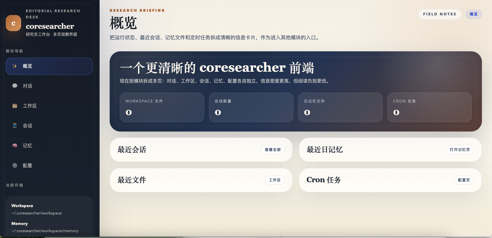

# coresearcher

[简体中文](README.md)

`coresearcher` is an asyncio-based personal AI assistant framework that combines a CLI agent, a local web UI, workspace-aware tools, memory, planning, scheduling, and channel adapters for Feishu and QQ.

It is designed for people who want a runnable assistant runtime instead of a single chat wrapper.



## Features

- CLI chat loop and local multi-page web UI
- Workspace bootstrap with editable agent context files
- Tooling for filesystem access, shell execution, web fetch/search, MCP, cron, subagents, and memory lookup
- Planning, reflexion, RAG, and session history management
- Provider abstraction with offline `mock` support for demos
- Channel adapters for CLI, Feishu, and QQ
- Built-in demos and evaluation scaffolding

## Quick Start

```bash
python -m venv .venv
source .venv/bin/activate
pip install -e .
python demos/open_source_demo.py
```

The default demo is fully offline. It creates an isolated config and workspace under `.demo/open_source_demo/`, runs a few chat turns with the mock provider, and prints the next commands you can try.

To open the local web UI with the generated demo config:

```bash
CORESEARCHER_CONFIG=$(pwd)/.demo/open_source_demo/config.json python -m coresearcher web
```

Then visit `http://127.0.0.1:8765`.

## Using a Real Provider

You have two options:

1. Start from the example config:

```bash
cp config.example.json ~/.coresearcher/config.json
```

2. Or run the interactive setup:

```bash
python -m coresearcher onboard
```

After that, try:

```bash
python -m coresearcher agent -m "Hello"
python -m coresearcher status
```

## Public Channels

`coresearcher` includes optional channel adapters for:

- Feishu
- QQ

These integrations are part of the public project, but they require platform credentials and app setup. For local development, the CLI and web UI are the recommended starting points.

## Repository Layout

```text
coresearcher/              Core package
providers/            Provider compatibility layer reused by coresearcher
demos/                Runnable demos and smoke checks
eval/datasets/        Public evaluation datasets
config.example.json   Minimal configuration template
```

## Packaging Notes

- Public docs live in `README.md` and `README.en.md`.
- Local runtime state, logs, generated eval outputs, and internal notes are intentionally ignored.
- Workspace bootstrap templates are packaged under `coresearcher/workspace/templates/` so the public repo does not depend on a private local workspace.

## Docs

- `docs/architecture.md`
- `docs/channels.md`

## Contributing

See `CONTRIBUTING.md` for setup and smoke checks.
